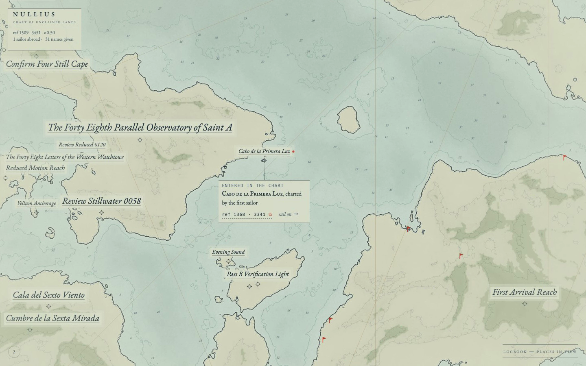

# nullius

*a chart of unclaimed lands*

Sail an endless procedural archipelago drawn as a hand-engraved nautical
chart. Every red pennant is a place nobody has named yet. Reach one, give it
a name, and it is inked onto the chart — permanently, for every sailor who
comes after you.

**[sail the chart →](https://nullius-three.vercel.app)**



https://github.com/miguelgarglez/nullius/assets/launch.mp4 ·
[docs/launch.mp4](docs/launch.mp4)

## how it works

- **The world is a seed.** Terrain comes from hash-seeded value noise — fBm
  with domain warp under an archipelago mask — evaluated in integer
  arithmetic so every browser renders the identical coastline. Landmarks
  (islands, peaks, bays, capes, lagoons, rocks) are extracted deterministically
  per region cell, so a place exists at the same spot forever. A pinned
  determinism test guards the terrain math: if it ever drifted, existing
  names would orphan.
- **The chart is engraved, not rendered.** Marching-squares contours become
  double-struck coastlines; hills get hachure ticks; the sea gets soundings,
  rhumb lines and a compass rose. Tiles render at multiple LODs and crossfade
  as finer detail arrives — the paper never flashes placeholders.
- **First writer wins.** Names live in a shared Supabase ledger
  (`nullius_claims`, `feature_key` primary key, read-all/insert-only RLS).
  A race is settled atomically by the database: the loser's card keeps a
  durable "your name arrived too late" verdict beside the winner.
- **Names are inscriptions, not tooltips.** A claimed place keeps a survey
  benchmark on its exact point; its name inks in letter by letter on a quiet
  vellum clearing, wraps or shrinks to fit the chart, yields rather than
  overprints a neighbor, and is drawn after every mark so nothing crosses it.
- **Other sailors are present.** A Supabase realtime channel broadcasts each
  visitor's position as a small ship glyph on the chart, and the title margin
  counts the sailors abroad.

## run it

```sh
npm install
npm run dev      # http://localhost:5173
```

Without env vars it sails offline — the chart works, claiming waits for a
ledger. To run against your own Supabase project, apply
`supabase/migrations/`, then:

```sh
cp .env.example .env.local   # or create it:
# VITE_SUPABASE_URL=https://<project>.supabase.co
# VITE_SUPABASE_ANON_KEY=<publishable key>
```

## controls

| input | action |
|---|---|
| drag / touch | sail (fast release carries momentum) |
| scroll / pinch | zoom |
| tap a red pennant | name that place |
| `logbook` | every reachable place in view, keyboard-operable |
| `?` | bring back the sailing notes |
| `Esc` | close whatever is open |
| `#x,y,scale` | shareable bearing — the ref on any plaque copies one |

Honors `prefers-reduced-motion` (glides and the sink ceremony settle
instantly), keeps every target ≥44px on a 375px screen, and stays readable
when the ledger is unreachable — the chart keeps sailing offline and the
form never loses what you typed.

## stack

Vite + React + TypeScript, one canvas, zero map libraries. Supabase Postgres
for the claims ledger, realtime for presence and new inscriptions. Deployed
on Vercel.

MIT — sail on.
